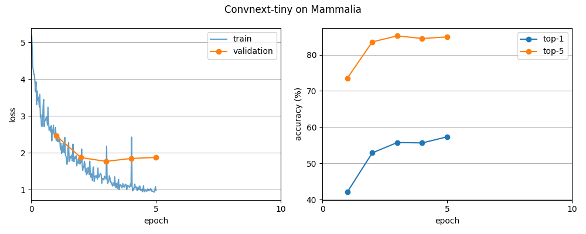

# iNaturalist 2017 Species Classification

Fine-grained image classification on the [iNaturalist 2017](https://github.com/visipedia/inat_comp/tree/master/2017) dataset. Each run trains a model on one super-class (for example Mammalia or Arachnida) using the official train/val split, and reports image-weighted top-1 and top-5 accuracy.

The project started with a from-scratch YOLOv1-style CNN, then moved to ImageNet-pretrained ResNet-18, ResNet-50, ConvNeXt-Tiny, and ConvNeXt-Small. Not every super-class has been trained with every model.

## Dataset

Images come from the 2017 `train_val_images` release (about 186 GB). Torchvision stores them under `data/2017`. Train and val photos share species folders; the split is defined only in the annotation JSON files, not in the image tree.

| Super-class | ID | Species | Train | Val |
|---|---:|---:|---:|---:|
| Actinopterygii | 0 | | | |
| Amphibia | 1 | 115 | 15,318 | 2,385 |
| Animalia | 2 | | | |
| Arachnida | 3 | 56 | 4,873 | 1,086 |
| Aves | 4 | 964 | 214,295 | 21,226 |
| Chromista | 5 | | | |
| Fungi | 6 | 121 | 5,826 | 1,780 |
| Insecta | 7 | | | |
| Mammalia | 8 | 186 | 29,333 | 3,490 |
| Mollusca | 9 | 93 | 7,536 | 1,841 |
| Plantae | 10 | | | |
| Protozoa | 11 | | | |
| Reptilia | 12 | | | |

Blank cells have index files that can be built with `src/subset.py` but have not been scored in this README. Species counts are the number of kept classes after filtering the chosen super-class.

## Models

| Prompt | Architecture | Weights | Optimizer |
|---|---|---|---|
| `y` | Custom YOLOv1-style CNN | from scratch | SGD |
| `18` | ResNet-18 | ImageNet-1K | SGD |
| `50` | ResNet-50 | ImageNet-1K | SGD |
| `tiny` | ConvNeXt-Tiny | ImageNet-1K | AdamW |
| `small` | ConvNeXt-Small | ImageNet-1K | AdamW |

The final linear layer is replaced with one of size `num_classes` for the chosen super-class (`fc` on ResNet and YOLO, `classifier[2]` on ConvNeXt).

## Training

Hyperparameters live in [`config/train.json`](config/train.json). Crops are 320×320.

- **Train:** `RandomResizedCrop`, horizontal flip, color jitter, ImageNet (or dataset) normalization, then random erasing
- **Val:** resize shortest side to 320, center crop 320
- **Loss:** cross-entropy with label smoothing 0.1 on the training set only
- **Precision:** mixed precision (`torch.amp`)

SGD models use learning rate `1e-3`, momentum `0.9`, and weight decay `5e-4`. ConvNeXt uses AdamW at `1e-4` with weight decay `0.05`. ConvNeXt-Small uses a training batch of 32; the others use 64.

Checkpoints are written to `models/checkpoint_{name}_{order}.pt` after the requested number of epochs. They store weights, optimizer state, epoch, and the loss/accuracy histories used by the plot script. Choosing **continue** (`c`) loads that file and trains further; a new run (`n`) starts from ImageNet (or random YOLO) weights and overwrites the same path.

## Setup

Python 3.11+ with PyTorch and torchvision (CUDA recommended). From the project root:

```bash
pip install torch torchvision matplotlib
```

1. Let torchvision download the 2017 images into `data/` on the first run, or place `train_val_images` there yourself.
2. Download the 26 MB annotation zip and extract it so these two files exist:
   - `data/train_val2017/train2017.json`
   - `data/train_val2017/val2017.json`
3. Build index files for each super-class you want to train:

```bash
python src/subset.py
```

That writes `data/stats/{order}_indices_train.json`, `_indices_valid.json`, and `_kept_classes.json`.

## Usage

Run every script from the project root. Each one asks for a model and a super-class number (0–12).

```bash
python src/main.py      # train or continue
python src/eval.py      # score a checkpoint on val (does not train or save)
python src/plot.py      # loss and accuracy curves → results/
python src/per_class.py # per-species top-1 on val (ResNet-50 checkpoints)
```

To drop the learning rate on continue, change `learning_rate` for that model in `config/train.json` before choosing `c`. The continue path copies that value onto the loaded optimizer.

## Results

Validation is image-weighted top-1 / top-5 on the official 2017 val split for that super-class. These numbers are a snapshot; several ResNet-50 runs were stopped early or later restarted, which overwrites `models/checkpoint_resnet50_{order}.pt`.

**ConvNeXt-Tiny** (5 epochs, AdamW `1e-4`, 320 crop) is the strongest finished set so far:

| Super-class | Top-1 | Top-5 | Val loss |
|---|---:|---:|---:|
| Arachnida | 76.2% (828/1086) | 95.9% | 0.89 |
| Fungi | 74.2% (1321/1780) | 94.4% | 1.09 |
| Mollusca | 66.8% (1229/1841) | 90.2% | 1.42 |
| Mammalia | 57.3% (2001/3490) | 84.9% | 1.87 |



**Other selected runs**

| Model | Super-class | Epochs | Top-1 | Top-5 |
|---|---|---:|---:|---:|
| ConvNeXt-Small | Arachnida | 5 | 73.4% | 93.3% |
| ResNet-50 | Mammalia (320 crop) | 25 | 52.5% | 81.5% |
| ResNet-50 | Mammalia (224 crop) | ~25 | 48.7% | 80.1% |
| ResNet-50 | Fungi | 15 | 65.0% | 91.3% |
| ResNet-50 | Arachnida | 5 | 38.2% | 72.6% |
| ResNet-50 | Amphibia | 5 | 24.8% | 52.2% |
| ResNet-50 | Aves | 1 | 9.7% | 21.2% |
| ResNet-18 | Mammalia | ~23 | 41.6% | 73.6% |

Arachnida is the smallest label set (56 species) and reaches the highest Tiny accuracy. Mammalia is harder mainly because of similar species and subspecies, not because of fewer images per class. Aves is 964-way, so a single epoch is not comparable to a finished mammal run.

Published iNaturalist 2017 numbers (Van Horn et al., CVPR 2018) are 5,089-way and often per-species averages, so they are not a direct comparison to these super-class, image-weighted scores.

## Layout

```
config/train.json   # epochs, optimizer, batch size, learning rate per model
src/main.py         # train / continue
src/eval.py         # validation only
src/train.py        # train and test loops
src/dataset.py      # loaders, augments, class mapping
src/subset.py       # official split → index JSON
src/plot.py
src/per_class.py
src/YOLOV1.py
data/2017/          # images (not in git)
data/train_val2017/ # annotation JSON (not in git)
data/stats/         # per-order indices and kept class ids
models/             # checkpoints (not in git)
results/            # training plots
```
